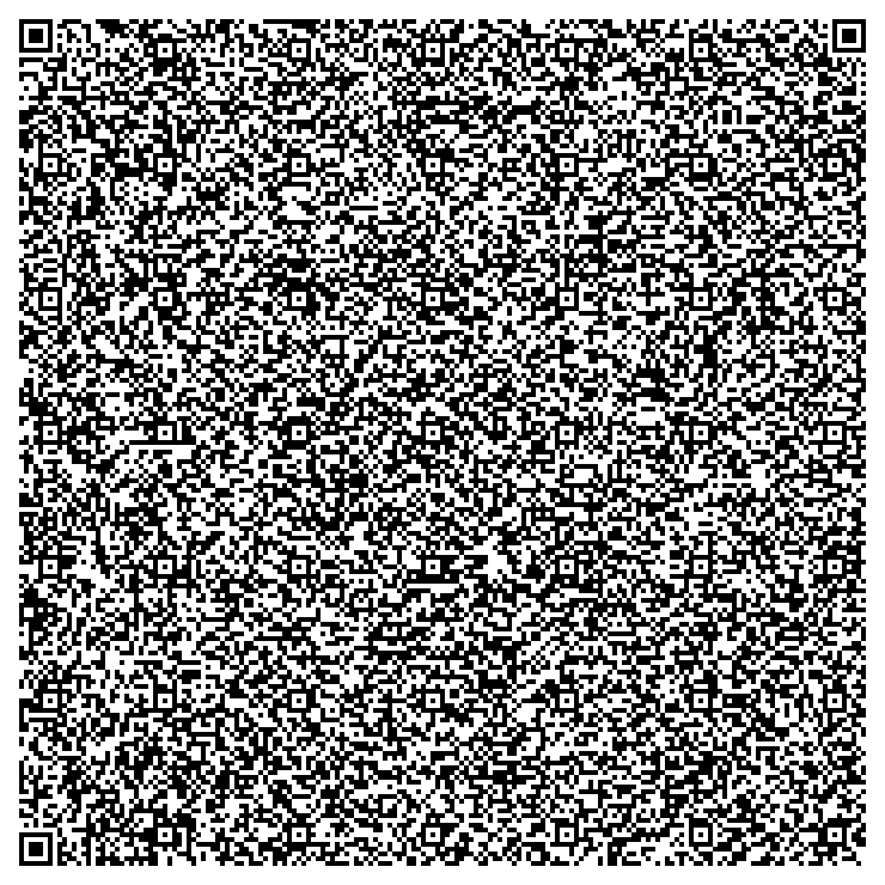

(this is still a draft research project)

## Agentic QR Codes

> ***Research Questions:*** _Is it possible to create a single self-contained QR code that generates a Large Language Model (LLM) simulated Operating System (OS)? Can an LLM OS be used to generate full-dive mixed realities?_

## Technical Foundation

Standard QR codes offer remarkable data capacity, with Version 40 (177x177) supporting up to 2,953 bytes of raw data with error correction. QR codes are ubiquitous and can be scanned from nearly any device. The algorithm is open-sourced and has been encoded across a wide range of creative mediums:

<table>
  <tbody style="text-align: center">
    <tr>
      <td>
        
        

          <a href="https://www.youtube.com/watch?v=w5ebcowAJD8">Veritassium: Physical QR Code Construction</a>
        

      </td>
      <td>
        
        

          <a href="https://www.righto.com/2009/01/qr-codes-in-lego.html">Ken Shirriff: LEGO-Encoded QR System</a>
        

      </td>
    </tr>    
  </tbody>
</table>

"Agentic QR codes" are ones that contain all the code necessary to bootstrap an LLM OS. An LLM OS is an Operating System metaphor that imagines AI as the Central Processing Units of generative virtual machines:

<table>
  <tbody>
    <tr>
      <td style="text-align: center">
        
        

          <a href="https://huggingface.co/blog/shivance/illustrated-llm-os">
            Illustrated LLM OS: An Implementational Perspective
          </a>
        

      </td>
    </tr>    
  </tbody>
</table>

## Browser implementation

A web browser makes a good host for an LLM OS as we can use it to spin up a local database, access device sensors and inputs and outputs, and interact with the Browser and Web APIs without any further setup

The following QR codes contain an HTML file that do the same thing, but one is bootstrapped for local models and the other for cloud. This minimalist LLM OS that is bootstrapped to do the following:

- Enable prompting through the URL by adding `?prompt`
  - `?prompt='create a working calculator'`
  - `?prompt='change the background to black'`
  - `?prompt='show an animation when it calculates'`
- Create new files in memory by changing the URLs `#hash`
  - `#spreadsheets`
  - `?prompt='create a working spreadsheet app'#spreadsheets`
  - `?prompt='a page to edit the indexeddb memory of this app'#memory`
- Prefix other files with `?boot=file`
  - `?boot=calculator`
  - `?boot=desktop,handsfree`
  - `#boot` is a special hash, its contents is always prefixed to every file

<table>
  <thead>
    <tr>
      <th colspan=1><h3>Ollama (local)</h3></th>
      <th colspan=1><h3>OpenRouter (cloud)</h3></th>
    </tr>
  </thead>
  <tbody>
    <tr>
      <td>
        <h4><a href="https://ollama.sh">Ollama.sh</a></h4>
        
<a href="./ollama.html">Source</a>, <a href="https://recursivefaith.github.io/qrcoding/ollama">Hosted</a>

        
        <ul>
          <li>Default model: <a href="https://ollama.com/library/deepseek-r1:8b">deepseek/deepseek-r1</a>
          <li>Supports vision models</li>
          <li>Don't forget to <a href="https://github.com/ollama/ollama/blob/main/docs/faq.md#how-do-i-configure-ollama-server">enable CORS in Ollama</a></li>
        </ul>
      </td>
      <td>
        <h4><a href="https://openrouter.ai">OpenRouter.ai</a></h4>
        
<a href="./openrouter.html">Source</a>, <a href="https://recursivefaith.github.io/qrcoding/openrouter">Hosted</a>

        
        <ul>
          <li>Default model: <a href="https://openrouter.ai/deepseek/deepseek-r1">deepseek/deepseek-r1</a>
          <li>Supports vision models</li>
          <li>Free API keys available</li>
        </ul>
      </td>
    </tr>    
  </tbody>
</table>

### How to use the QR codes

- Create a `.html` file on your desktop or device
- Scan one of the QR codes above
- Copy the decoded string into the `.html`
- Open that file in a browser

Once the LLM OS bootstrap file above is created, you can then generate QR codes that use the `?prompt#filename` pattern to prompt and control your LLM OS using QR codes

### The database

Data is persisted using the browser's IndexedDB and localStorage APIs. By default `editor` is used as the table name. If you open these files directly in your browser without a server, the data will be mapped to that specific filename. Changing the filename would generate a new IndexedDB database (while keeping the old one)

For production use, it's recommended to run a server (todo: explain how)

<!--

### Creating a simple server

When loading a file directly in the browser it's loaded in the `file://` protocol, instead of `http://`. This works but minimizes the amount of Browser APIs you have available, and if you ever move or change the file name the data could be lost

It's recommended to generate your QR codes for a server. On Linux and Mac you can try `python3 -m http.server 9000`

-->

## Development Notes

- To generate these QR Codes
  - I first compress the HTML with https://htmlcompressor.com/compressor
  - I then encode it into a QR code with https://www.nayuki.io/page/qr-code-generator-library
- QR Code limits:
  - Raw byte data: `17 to 2,953 bytes`
  - Numeric characters: `41 to 7,089 characters`
  - Alphanumeric: `25 to 4,296 characters`
